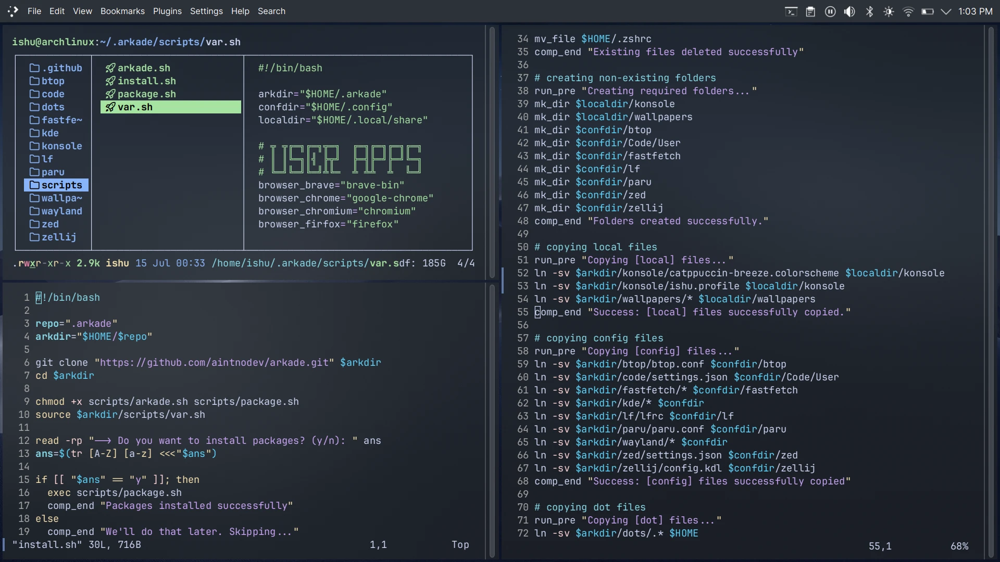

# Arkade: Arch + KDE Setup



> _[Breeze Dark](https://invent.kde.org/plasma/breeze) theme with [Polonium](https://github.com/zeroxoneafour/polonium), an autotile manager for Plasma 6._

## Introduction

My dotfiles and config files resides here. Feel free to modify and use as per your likings.

## Installation

### Automatic

Run the following command and you are good to go.

```sh
sh -c "$(curl -fsSL https://raw.githubusercontent.com/aintnodev/arkade/master/scripts/install.sh)"
```

### Manual

1. Clone the repository in your `$HOME` directory or download the zip and extract it as `.arkade`
2. If you chose not to rename it as `.arkade` then you'll have to change to some script variables.
3. Make sure to review scripts anyway. It's always a good practice none the less.

## Uses

Since I use a desktop enviroment, most of the apps I use are centered around KDE

- Operating System: [Arch Linux](https://archlinux.org/)
- Terminal: [Konsole](https://invent.kde.org/utilities/konsole)
- Browser: [Brave](https://brave.com/) and [Firefox](https://www.mozilla.org/en-US/firefox/)
- File Manager: [lf](https://github.com/gokcehan/lf)
- PDF/EPUB Viewer: [Firefox](https://www.mozilla.org/en-US/firefox/) and [Play Books](https://play.google.com/books)
- Fonts: [Inter](https://github.com/rsms/inter) and [JetBrains Mono](https://github.com/JetBrains/JetBrainsMono)

My personal website is not ready yet (skill issue) but I'll copy it there too once its ready.

## Commit guidelines

Write your commit message in this way:

**[type] ( [scope?] ): [description]**

Types:

- feat: A new feature
- fix: A bug fix
- refactor: A code change that neither fixes a bug nor adds a feature
- doc: Documentation changes
- build: Changes that affect the build system or external dependencies
- chore: Other changes that don\'t modify src or test files
- revert: Reverts a previous commit

Scope: Optional, refers to the part of code changed in this commit.
